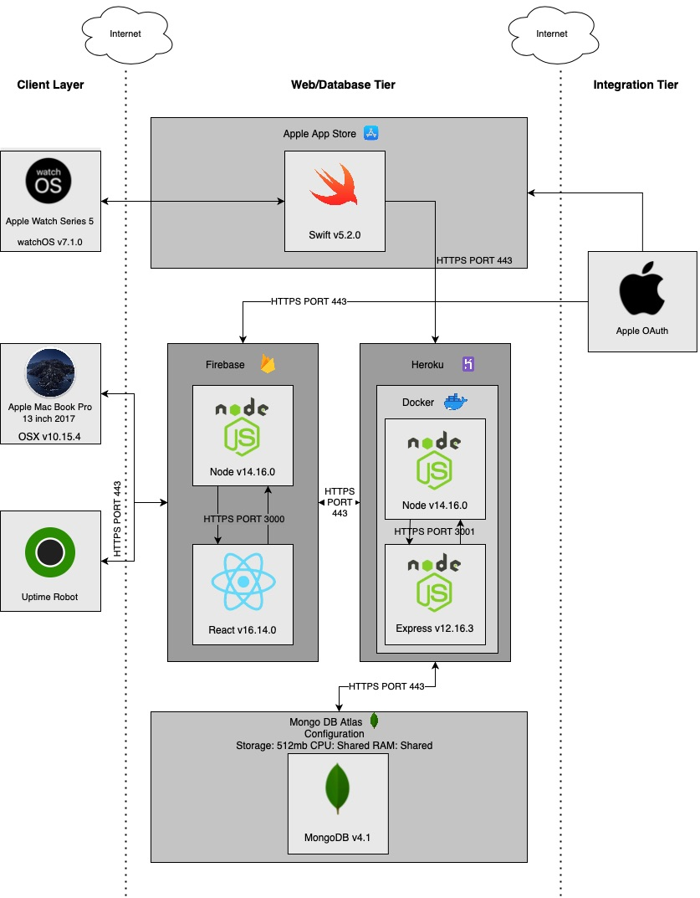

# iHeartRate 

  

  <h3>Table of Contents</h3>

<h1>Overview </h1>
<h3>Description</h3>
The project consists of two main applications, an Apple Watch app and a website. The combination of these two applications provide a user with a more informational and interactive interface to display the user’s heart rate data. From the user’s Apple Watch the application will send the heart rate information collected by it and send the data to the website. The website will be able to display the collected information such as the current heart rate and view past heart rate data entries. The website will also offer inputs to select certain period of time to display that on a table and chart for visual aid. Overall this project is to be able to get more use of the information collected on a person smart watch. 
<h3>Technologies Used</h3>

  

<h3>Why These?</h3>

  
Click to Expand

  <b>React JS</b>
  <blockquote>
    React is a light weight framework in JavaScript that is great for dynamic web pages. For the dashboard setup that iHeartRate includes the table, graph, average heart rate, and the last recorded. All of these components must be updated with the click of a button. With React this is done easily with its capabilities such as state and props.
  </blockquote>
  <b>Express JS</b>
  <blockquote>
    Just like React, Express JS is a very light weight application that is easily configured in order to create a REST API. Express also has many libraries that help with the implentation of cross platform request and other Dev Op principles. This means that it is very easy to implement logging and cross origin reasource sharing through middleware.
  </blockquote>
  <b>Node JS</b>
  <blockquote>
    Node JS is used inorder to setup servers for both the frontend and backend of the application. This specific server allowed both application to use some of the same librarys in order to set up both the applications.
  </blockquote>
  <b>JavaScript</b>
  <blockquote>
    JavaScript and the frameworks that are upon it were used in order to make the application dynamic and very light weight for the users to work with. 
  </blockquote>
  <b>Swift</b>
  <blockquote>
    Swift was used in order the Apple Watch application as it is the only language that can walk with WatchOS. 
  </blockquote>
  <b>Visual Studio Code</b>
  <blockquote>
    The specific code editor was used beucase of the extentions that are easily configured. There are many extentions to help build and deploy React, Express, and Docker applications.
  </blockquote>
  <b>xCode</b>
  <blockquote>
    Apple's xCode envirement as it also is the only platform to work with WatchOS and swift. This IDE also a very detialed GUI in order to setup the layout of the Apple Watch Application.
  </blockquote>
  <b>MongoDB</b>
  <blockquote>
    Rather the using a SQL database the applicaiton uses MongoDB. As React and Express primarly deal with JSON formated data to pass around Mongo offers a great platform in order to store and retrieve JSON formated data.
  </blockquote>
  <b>Heroku</b>
  <blockquote>
    Heroku is used to deploy the Express application that is within a Docker containers. This platform made the process really simple with the Heroku CLI in order to deploy the Docker Image created by the Express Application
  </blockquote>
  <b>Vercel</b>
  <blockquote>
    Vercel is a cloud platform that is the most compatable with react applications. It also offered a code pipeline service to be hooked up to GitHub or Bitbucket in order to implement CI/CD features.
  </blockquote>
  <b>Docker</b>
  <blockquote>
    Docker was used in order to put the Express Application in a container in order to simplify deployment. Using a docker image mean that if the application is able to run locally the image can run on any system that has Docker.
  </blockquote>

<h3>Applications Functionality</h3>
<b>Web Application</b>

  1. Sign in using the users Apple ID
  2. View heart rate data that was recorded by the users apple watch
  3. Have a table and graph displaying the data
  4. Have the average and last recored heart rate displayed to the user
  5. Select heart rates from a certian time period
  6. Download all heart rate information from the users account
   
<b>Apple Watch Application</b>

  1. Sign in using the users Apple ID
  2. Start recording heart rate data to the iHeartRate applicaiton
  3. Stop recording the heart rate information

<h1>Design</h1>
<h3>Logical Solution Design</h3>
The logical system design of the iHeart Rate project describes how the code will logically flow through the application. Starting from the client layer the user can interact with the project on two platforms: web browser and Apple Watch. An Apple MacBook Pro and Apple Watch Series 5 are listed as they are the two devices that the application is being developed and tested on. 
The front end of the web application will be deployed using Vercel and the backend is deployed with Heroku. The user will interact with the front end of that application that is written with the React framework. React makes a use of components and services in order to display and retrieve information to and from the user. The components for this application include home, main and sign in to create all the views of the application. These components make use of the user and heart rate service in order to create REST API calls to the back end using the library of Axios. Axios is a JavaScript library that has the ability to make HTTPS request. These HTTPS requests are handled by the Express application for the back end of the application. The routes within the express application can pick out the data form the HTTPS request and create models from the data. Within Express there are two models that are implemented one for the user object and another for the heart rate object. These models make it easy to send the object data between both business and data services as the Express application uses the DAO design pattern. The business services either, user business service or heart rate business service are created in order to transfer data from the routes to the data services. There are only two data services as there are only two object models that the application deals with. The data services connect the backend of the application to the MongoDB Database. The database that is running on the cloud using Mongodb Atlas which contains two collections: user and heart rate in order to hold documents of the object models. 
The application has a similar path of data and code logic however the beginnings of the process are different. As the Apple Watch app cannot be deployed on a cloud platform it must be hosted from the Apple App Store. The front end and service layer code for the apple watch app will be done in Swift. Swift is a responsible for setting up the front end of the application and making the REST API calls to the back end. With the addition of the URL Session library provided by Swift the creation of HTTP requests is just as easy as Axios. The HTTP request is then sent to the Express application in AWS just as Axios did with the request from React. After the request reaches the Express application the data follows the same flow as the request from React did to reach MongoDB.

  

<h3>Physical Solution Design</h3>
The physical solution design below of the iHeart Rate project displays the technologies, services and platforms that are used in order to deploy the application. Starting with the web application there are two platforms in which interact with the entirety of the AWS container, the two being a web browser and Up Time Robot. Up Time Robot is a monitoring tool for cloud applications test the reliability of the application, this will be described more within the Operational Support Design section. The web application interacts with the front end of the application through HTTPS port 443 to make HTTPS requests. The first host the cloud host whether it be Vercel for the frontend or Heroku for the backend. The request will then meet docker container which will route it to the application. The connection between the frontend and the backend will follow the same path going from the docker container to the cloud platform to the internet. The same goes for the connection between the backend and the database, Mongo is using AWS to host a container in order to store the information. This connection is made through a mongoose object that has the srv to the Mongo Atlas database that will send request using HTTPS.
The path of a request from the Apple Watch Application follows a similar path but just like the Logical System Design it does start out different. The Apple Watch application will be deployed on the App Store where any user can download it. Once the application starts making request it uses the same HTTPS port 443 in order to access the Express application through a secure connection. Once in the Express application the data will pass through the different layers all the way to be able to access the database just as the web request did. For all deployments certain processing powers and storage are allocated in order to get the information in-between the application as quickly and securely as possible
The database running on Mongo starts out with shared ram and CPU cores as well as 512mb to store information. Though this may seem small the database can scale up and down in performance based on the metrics is needed to perform action seamlessly. As for the frontend deployed in Vercel the application starts with 1024MB of RAM, shared CPU, and 512mb of storage with scalable storage and memory. Lastly the Heroku deployment which houses the backend of the application starts out with 512mb of RAM, shared CPU and saleable storage. 

  

<h3>Database ER Diagram</h3>
The diagram below displays the design documentation for the database. For this project the database will be hosted by MongoDB Atlas on the cloud. It will contain two collections: ‘User and ‘Heart_Rate’: 

  

<h3>Site Map</h3>
The figure below shows the site map diagram for both the web and apple watch application. On the left, the web application, the website will begin the user at the home page which will have the Sign In With Apple button in order to take them to the graphical viewing page. On the right hand side the Apple Watch Application is displayed, this is a very simple application with two pages: the sign in page, and the start/stop button page.

  

<h3>UML Class Diagram Express</h3>
The Diagram below display the class design of the back end of the application which is implemented by Express JS. Starting from the top of the diagram there are two models: user and heart rate. Both the user and heart rate properties are described above within the Database ER Diagram. The methods of both are listed below their corresponding properties and consist of the getters and setters of the properties. Moving down from both the models each has its own router functions which sets up the REST API service. These functions do not contain any properties, but each individual method is a separate REST API call. These calls used a library within Node called mongoose that makes it easy to connect with MongoDB. The object model is setup using mongoose in order to input the data in to the correct connection. Setting up the mongoose object with the connection string to the database, within the router will then persist the data into the database.

  

<h3>UML Class Diagram React</h3>
The diagram below outlines the UML Class Diagram structure of the front end of the application implemented with react. React works with components and within each of them there are props, state and methods. Props in react are variables that are sent between different components such as a user that is signed into the application. State are variables that are only specific to each component and can be used to display certain information on the page based on user input for an example. Lastly methods are just the actions that the component such as an onChange method in order to handle an input from the user. The home page does not have very many moving components on the screen as can see by the class diagram. The only logic that is occurring for this page is the ‘Sign in with Apple feature’ most the logic is completed by Apple oAuth functionality itself. On the other hand, the dashboard page has a lot of state variables and methods.  This page contains properties to set the table, graph, average heart rate, last recorded heart rate and all the properties that help with that information. The methods within this page are to handle and set all the components for the user output and render the page when it loads in. There are no props used through this project because the user information for the user will be stored in an HTTP cookie so that the information can be accessed anywhere. 

  

<h3>UML Class Diagram Swift</h3>
The diagram below outlines the class structure within swift for the Apple Watch application. The interface controller set up the view and the workout that is needed to record the heart rate of the user. The BMP of the user is then sent to the Heart Rate Service to be able to make an HTTPS request using URL Session library. 

  

<h3>UML Sequence Diagram Apple oAuth</h3>
The diagram below displays the flow of data that happens when a user request to login with ‘Sign in with Apple’ from the React application:

  

<h3>UML Sequence Diagram Frontend calling Backend</h3>
The diagram shows the flow of data when the User is with Main component of the react application. The component will first grab all the heart rate information from by the user’s ID. Once the user changes the date it will trigger the onChange to get the updated data list. 

  

<h3>UML Sequence Diagram Apple Watch calling Backend</h3>
The diagram below displays the sequence the data from the apple watch takes when a new heart rate needs to be saved within the database.

  

<h3>Deployment Diagram</h3>
In the figure below outlines the deployment structure of both the web and Apple Watch application. The deployment will contain the Apple Watch Application being hosted on the Apple App Store, React will be deployed using Vercel in a docker container, Express will also be inside a docker container though hosted on Heroku, and the database will be deployed with MongoDB Atlas.

  

<h1>Final Product</h1>
<h3>Cloud Deployment</h3>
As mentioned above the web applicaiton is currently deployed on multiple different cloud platforms. For the frontend of the application beucase it is a React application it was deployed on Vercel. This specific cloud platforms offers the best support for any React or Node application. For the backend it was first containerized using Docker then deployed on Heroku. Docker made the deployment very easy as if the container runs locally it will also be able to run the same on another system.
<h3>Best Practices and DevOps Principles</h3>
To start with best practices of programming each indiviual applicaiton implement some sort of logging in the own way. For Swift a libray called NSLog was able to print out log statments all the same format with a date and time stamp as well as severity. For Express the application is set up with middelware inorder to intercept each request and grab the HTTP method, body, and parameters in order to log the statment. Lastly for React the only logging that was done was completed within the development stage. As React has not logging library the only way to output information was by logging it to the console. These statments were all taken away before deployment as sesitive information was shared in the log statments. Another best pratice used was data validation through the web frontend. Though there was only one input for the web application it was fully validated to only take in a certain format of a date. Lastly all the code was commented with the proper annotation for each application. 
As well as best practices there was also DevOps Principles that were implemented into each application. The first one is carried over from the best pratices which is logging, this information will help if there was every a bug with the applicaiton. The second DevOps Principle that is used through the frontend of the application is CI/CD, this was implmented through Vercel as it was connected to a GitHub Repository. Lastly Uptime Robot was implemented in to the application in order to ensure that both the frontend and back end are accessible at any time, and if not will trigger an alert in order to say one of the applications was down. 
<h3>New Technolgies</h3>
Most all of the technologies that are used throughout this project were new or worked with very minimaly. Learning Swift helped with understanding IOS and WatchOS applications.  React helped created a light weight dynamic webpage that can be implmented in various different applications. Express was leanered in order to get a beter understand of Node and create a dedicated REST API application. Mongo offered a different expirence from a SQL database as there is not configuration needed for the collection within the database. The different cloud plaforms all offered various different features that were crutial to the deployment of the application. 
<h3>Challenges</h3>
Throught the production of this application there was various different problem that occured, some thorugh planning and other in the actual implementation of the application themselves. On of the bigges problems that was solved during planning was how to connect the user's apple watch to the user's account on the web application. This was fixed by the implmentation of signin with apple. This gave both applications the ability to have the same connection using Apple's oAuth services. 
